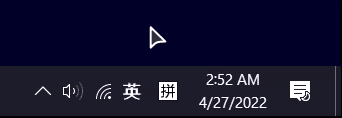
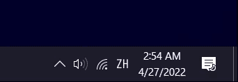
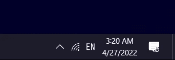

# IME Indicator

A better IME (Input Method Editor) indicator for Windows 10/11

## Features

Have you ever run into this problem before?

Microsoft never fixed it, so I did:

It supports any keyboard layout, it uses 
[ISO-639-1](https://en.wikipedia.org/wiki/List_of_ISO_639-1_codes) two-letter 
language codes to indicate the current keyboard layout.

## Quick Start

1. Open setting, go to Personalization - Taskbar, under `Notification area`, 
click on `Turn system icons on or off`.

2. Set `Input Indicator` to `Off`.

3. Open `IMEIndicator.exe`.

4. Enjoy!

## Launch on Windows Startup

1. Create a shortcut for IME Indicator.

2. Open `%APPDATA%\Microsoft\Windows\Start Menu\Programs\Startup` in file 
explorer, or

3. Alternately, type `shell:startup` in the Run dialog (open by pressing 
`Win + R` keys).

4. Move the shortcut to that location.

5. IME Indicator should launch next time you start Windows.

## Usage

- Right click on the system tray icon will open Windows keyboard setting.

- Middle click on the system tray icon will quit the application.

## Acknowledgment

Icon text font: [Iosevka](https://github.com/be5invis/Iosevka)

Font subset tool: [Fonttools](https://github.com/fonttools/fonttools)

Keyboard hook: [Global Low Level Key Board And Mouse Hook](https://github.com/rvknth043/Global-Low-Level-Key-Board-And-Mouse-Hook)

## License

[MIT License](https://github.com/Icecovery/IMEIndicator/blob/master/LICENSE)